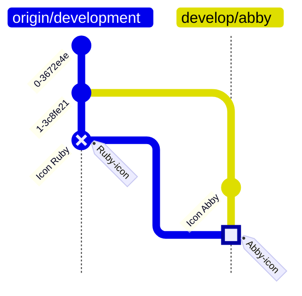
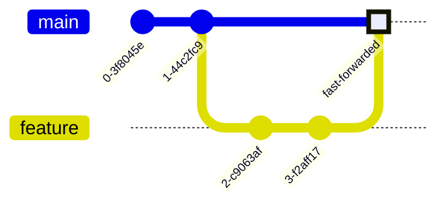

Hai para pembaca blog & pengejar tutorial, buat kalian yang nungguin kapan lanjutan dari ["Tutorial sakti belajar Git"](/2021/01/23/tutorial-sakti-git.html), di sini post lanjutannya. Intinya karena sibuk kerja, blog ini sudah aku tinggalkan hampir 3 tahun lamanya tanpa lanjutan post-post yang ada saat ini 😢

Tentunya sebelum baca tutorial sakti branching di Git, pelajari dasar-dasar penggunaan Git di artikel ["Tutorial sakti belajar Git"](/2021/01/23/tutorial-sakti-git.html) terlebih dahulu 😉

<!--more-->


*Git emergency tips: `git commit`, `git push`, leave! (Sumber istimewa)*

Demi 3 tahun lamanya kalian menunggu blog ini, jangan lupa `git commit` dan `git push` seandainya ada kejadian buruk yang menimpa kalian saat kalian mengerjakan project yang ada remote branch-nya (seperti GitHub, GitLab, BitBucket, dan lain-lainnya).

* TOC
{:toc}

Kalian udah nungguin 3 bagian terpenting, yaitu `git pull`, `git merge`, dan `git rebase` kan? Intinya, ketiga operasi branch ini tujuannya untuk menyusun commit agar sinkron dengan kerjaan terbaru kalian/rekan-rekan kalian, terutama jika anda ingin mengerjakan fitur sesuai dengan versi yang ingin anda kerjakan.

Sebelum lanjut ke inti pembahasan `git merge` dan `git rebase` aku berikan 1 contoh studi kasus tentang branching:

## Branch case study: Pengembangan fitur, branch development dan versi stabil

Dikisahkan terdapat 3 developer yang mengerjakan aplikasi mobile "Usagi Budgeting", salah satu *mobile app* yang bertujuan untuk mengatur budget pengguna dengan mengatur porsi gaji untuk jajan, nabung, top-up dompet digital, dan bayar tagihan.

Pada suatu hari, developer lead, **Haryanto**, rilis versi stabilnya, "v1.0". Versi tersebut mencakup fungsionalitas dasar dalam mengatur porsi keuangan untuk keperluan jajan, nabung, dan bayar tagihan. Namun versi tersebut belum bisa atur penbayaran tagihan otomatis *(auto-billing)* dan top-up dompet digital. Haryanto butuh 2 developer untuk mengerjakan fitur auto-billing dan top-up dompet digital.

Kedua developer tersebut, **Ruby** dan **Abby**, bagi porsi kerjaan untuk fitur auto-billing karena fitur tersebut perlu dikerjakan untuk versi 1.1 yang ditargetkan rilis bulan depan. Ruby mengerjakan fitur integrasi ke bank dan Abby mengerjakan fitur penjadwalan auto-billing.

Untuk selengkapnya, berikut pembagian tugas ketiga developer untuk versi 1.1:

1. Haryanto (Developer Lead): Review kerjaan, testing, dan *bugfixing* untuk versi stabilnya (versi 1.0)
2. Ruby (Developer): Auto-billing - Integrasi fitur auto-billing ke bank
3. Abby (Developer): Auto-billing - Penjadwalan auto-billing

### Development version branching

**Ruby** dan **Abby** perlu bikin branch `development` untuk dapat menampung fitur yang dikerjakan untuk versi selanjutnya. Agar dapat menfasilitasi versi development, mereka konsultasi ke dev lead, **Haryanto**, untuk dibuatkan branch `development`.

Agar branch development mengikuti versi stabilnya, v1.0, Haryanto buatkan branch `development` untuk menampung versi development dari branch `main` (branch untuk versi stabilnya), dan masing-masing branch untuk Abby dan Ruby sebagai `develop/abby` dan `develop/ruby` dengan mengikuti branch `development`.

Branch yang dibuat untuk project tersebut antara lain:

- `main`: untuk versi stabilnya (v1.0)
- `development`: untuk pengerjaan versi berikutnya (v1.1)
- `develop/abby`: untuk pengerjaan branch development oleh Abby
- `develop/ruby`: untuk pengerjaan branch development oleh Ruby

Atau jika dijabarkan dalam command git:

```bash
git branch # seharusnya ada pada branch `main`

# buat branch baru untuk versi development
git checkout -b 'development'

# buat branch baru untuk Abby dan Ruby
git branch 'develop/abby'
git branch 'develop/ruby'
```

Ketika Ruby dan Abby ingin pull dari versi development, mereka dapat melakukan `git pull` sebagai berikut:

```bash
# pull dari branch development
git pull origin 'development'
```

Ada 2 pendekatan `git pull`, yaitu:

1. `--merge`: Commit dari remote branch akan disatukan dengan commit lokal (default, tanpa stash),
2. `--rebase`: Commit yang dikerjakan secara lokal ditempatkan setelah commit dari remote branch (wajib stash, cocok apabila pengen melakukan eksperimen).

Opsi pendekatan `git pull` dapat dipilih saat instalasi Git di Windows:


*Opsi pendekatan `git pull` saat install Git for Windows*

Atau dapat diubah melalui git config:

```bash
# for local git pull by rebase configuration
git config pull.rebase

# for global git pull by rebase configuration
git config --global pull.rebase
```

### Kasus Ruby: Ngerjain fitur eksperimental integrasi auto-billing Bank SKSD

> **CATATAN:** Selama Ruby mengerjakan fitur eksperimental ini, Ruby belum pernah push kerjaan tersebut ke remote branch!

Ketika Ruby ingin mulai mengerjakan fitur auto-billing dan di tengah pengerjaan fitur tersebut, Ruby ingin mengerjakan fitur integrasi auto-billing ke Bank SKSD, Ruby perlu menyesuaikan fitur eksperimental dengan fitur yang dia kerjakan saat ini dengan command `git rebase`:

```bash
# ceritanya dia sedang mengerjakan fitur integrasi auto-billing di branch develop/ruby-sksd
git checkout develop/ruby-sksd
git rebase develop/ruby
```

Atau apabila Ruby ingin meneruskan kerjaan integrasi auto-billing ke Bank SKSD ketika Abby sudah melakukan *pull-request* dan berhasil digabungkan ke branch `development`, maka Ruby dapat melakukan pull dengan strategi rebase sebagai berikut:

```bash
# git pull rebase strategy
git pull --rebase origin development

# is a shorthand of
git fetch
git rebase origin/development
```

Apabila Ruby tidak menggunakan pendekatan `--rebase`, maka hasil pengerjaan integrasi tersebut akan tercampur dengan kerjaan Abby dan tentunya merepotkan, karena pendekatan yang digunakan adalah `git pull --merge` yang merupakan pendekatan bawaan/*default* dari `git pull`.

Apalagi jika pull tersebut mengakibatkan conflict karena lupa menggunakan pendekatan `--rebase`, maka masalah tersebut jauh lebih pusing bagi Ruby. Hal ini juga didukung dengan kerjaan fitur eksperimental yang hanya dikerjakan secara lokal dan belum di-push ke remote branch sama sekali.


### Kasus Abby: Pull dari branch development setelah Ruby mengerjakan fitur auto-billing

Hati-hati ketika Abby mengerjakan file `autobilling-page.js`, karena Ruby juga mengerjakan file tersebut dan sudah merge ke branch `development`.

Dikarenakan file tersebut terdapat perubahan yang dikerjakan oleh Ruby, maka Abby harus mengarsipkan file yang dikerjakan sebelum melakukan pull dari branch `development`. Jika tidak, Abby akan menemukan pesan error saat melakukan pull:

```
Please commit your changes or stash them before you merge. Aborting
```

Berikut gambaran branch project ketika Ruby sudah mengerjakan fitur dan sudah merge ke branch `development` melalui pull request:


Hal pertama yang perlu Abby lakukan adalah dengan `git stash` kemudian `git pull`. Setelah branch tersebut tersinkron dengan branch `development` terbaru, maka Abby dapat melanjutkan kerjaan dengan `git stash pop`.

```bash
# Setiap kali ada branch yang ingin di-pull, pastikan 
# working directory bersih dari file-file yang sedang dikerjakan
git stash
git pull origin development
git stash pop
```

Jika tidak ada masalah saat pull dari branch `development`, maka hasilnya adalah commit yang merupakan hasil merge dari branch `development`. Pembuatan commit tersebut merupakan hasil dari proses penggabungan kedua branch melalui `git merge` atau `git pull --merge` atau:

```bash
# git pull merge strategy
git pull origin development

# is a simpler form of
git pull --merge origin development

# is a shorthand of
git fetch
git merge origin/development
```

Apa yang terjadi jika Abby mengerjakan file tersebut di baris yang sama dengan Ruby kerjakan? **CONFLICT!**

Abby pun berpikir: "Lah gimana dong? Apa yang perlu aku lakukan?"

1. Selesaikan dengan pendekatan editing manual
2. Biar kerjaan Ruby kuasai file yang dikerjakan oleh Abby, Abby harus kerjain ulang dari awal (theirs)
3. Udah capek-capek Abby bikin, ditimpa sama Ruby, gak boleh ya! (ours)

Kalian pasti pilih jawaban pertama bukan? Tapi ada beberapa kasus yang mengharuskan Abby untuk memilih salah satu file yang digabungkan saat pull branch, semisal icon, logo, atau gambar.

Ketika Ruby dan Abby sama-sama menyediakan icon untuk auto-billing, *developer lead* memilih icon yang dikerjakan Ruby, sehingga Abby mau tidak mau ambil icon yang dikerjakan oleh Ruby. Oleh karenanya, Abby mengambil icon yang dibuat oleh Ruby dengan:

```bash
git checkout --theirs [path_to_dirs/autobilling-icon.png]
```


Atau sebaliknya, jika icon Abby dipilih oleh *developer lead*, maka Abby memilih file yang dia kerjakan sendiri dengan:

```bash
git checkout --ours [path_to_dirs/autobilling-icon.png]
```



Icon, gambar, video, suara, dan file biner lainnya merupakan salah satu kasus di mana penyelesaian masalah conflict hanya dapat dilakukan dengan strategi *"ours-theirs"*. File biner merupakan file yang tidak dapat diketahui perubahan isi file, sehingga perubahannya bersifat mutlak dan hanya dapat diselesaikan dengan memilih antara file yang dikerjakan sendiri atau dari orang lain.

Cara penyelesaian masalah tersebut disebut dengan strategi *"ours-theirs"*. Apa itu *"ours-theirs"*? Definisi dan penjelasan tentang strategi *"ours-theirs"* dijelaskan pada sub-bab [Conflict Resolution: Ours-Theirs](#conflict-resolution-ours-theirs).


## Git Pull

`git pull` dilakukan dengan sinkronisasi remote branch melalui `git fetch` untuk kemudian digabungkan melalui 3 pendekatan:

1. ***merge***: Commit dari remote branch akan disatukan dengan commit lokal (default, tanpa stash),
2. ***rebase***: Commit yang dikerjakan pada branch lokal ditempatkan setelah commit dari remote branch (wajib stash, cocok apabila pengen melakukan eksperimen),
3. ***fast-forward***: Jika tidak ada perubahan pada branch lokal dan terdapat perubahan pada remote branch, maka pointer pada branch lokal dimajukan ke commit branch remote paling baru.

Atau singkatnya, `git pull` dapat disinonimkan sebagai berikut:

```bash
# synchronize remote branch
git fetch
# merge or fast-forward to remote branch if no changes made on local branch
git merge <remote_name>/<remote_branch>
git merge origin/development # for example of merging from 'development' branch

# or can be simplified into:
git pull origin development
```

```bash
# synchronize remote branch
git fetch
# rebase from remote branch
git rebase <remote_name>/<remote_branch>
git rebase origin/development # for example of rebasing from 'development' branch

# or can be simplified into:
git pull --rebase origin development
```

Atau jika ingin melakukan pull dari branch remote yang sama, gunakan:

```bash
# without any arguments, it will pull from same remote branch
git pull
# is a synonym of
git pull <remote_name>/<same_remote_to_local_branch_name>
# if the current branch is 'development' 
# and remote branch is `origin/development`, then...
git pull origin development
```

## Git Merge

```bash
# merge from target branch
git merge <target_branch>
# merge from remote target branch
git merge <remote_name>/<remote_branch>
```

Digunakan untuk menggabungkan kerjaan dari branch lain terhadap branch yang kita dikerjakan (semisal commit dari branch `development` ke `develop/abby`). Penggabungan antar kedua branch dapat dilakukan melalui command `git merge` atau melalui **pull request** di situs repository remote branch.

Umumnya ketika branch tersebut digabungkan dari branch lain, maka akan ada commit baru yang berisikan informasi tentang branch yang digabungkan dengan commit message sebagai berikut:

```
Merge branch 'development' into develop/abby
```

Atau jika dari remote branch:

```
Merge remote-tracking branch of 'origin/development' into develop/abby
```

Apabila branch yang digabungkan tidak ada perbedaan terhadap branch yang dikerjakan (atau lebih baru), maka penggabungan branch tersebut tidak menghasilkan commit baru, yang bersifat ***fast-forward*** karena dilakukan rebase cepat tanpa mengubah commit apapun didalamnya.

Penggabungan branch yang bersifat *fast-forward* tidak berlaku jika terdapat parameter `--no-ff` yang akan menghasilkan commit baru berupa merge walau tidak ada perubahan pada branch lokal.

Terdapat beberapa opsi parameter untuk `git merge`, diantaranya:

- `--ff`: Majukan pointer lokal branch ke remote branch/branch yang digabungkan jika tidak ada perubahan pada branch lokal.
- `--ff-only`: Sama dengan `--ff` (alias *fast-forward*), namun tidak akan dieksekusi jika ada perubahan pada branch lokal.
- `--autostash`: Lakukan stash terlebih dahulu dan unstash setelah selesai penggabungan branch.
- `--squash`: Ambil semua file yang di-commit dari remote branch ke branch lokal, namun anda harus commit sendiri.

Dan jika terdapat conflict, maka terdapat dua opsi operasi penggabungan branch, yaitu:

- `--continue`: Lanjut merge/rebase ke commit selanjutnya.
- `--abort`: Batalkan merge/rebase dan dikembalikan ke kondisi sebelum merge/rebase.

Penggabungan branch melalui `git merge` dapat digambarkan sebagai berikut:


Atau jika branch yang digabungkan lebih baru dan tidak ada perbedaan terhadap branch yang dikerjakan:



### Pull Request

Ketika anda ingin menggabungkan branch yang dikerjakan ke branch tujuan (semisal branch `develop/abby` ke `development`), tidaklah mudah untuk menggabungkan kerjaan tersebut secara langsung tanpa seizin pemilik repository. Salah satu pendekatan yang dapat dilakukan saat penggabungan branch adalah melalui ***pull request***.

***Pull request*** adalah pengajuan dari seorang developer untuk menggabungkan branch tersebut ke branch tujuan secara remote. *Pull request* dapat dilakukan melalui situs repository remote branch, semisal GitHub, GitLab, BitBucket, dan lain-lainnya; serta dapat dilakukan dari branch ke branch maupun branch dari *forked repository* ke repository utama.

Pull request dilakukan dengan memilih branch yang dikerjakan untuk digabungkan ke branch tujuan (semisal `develop/abby` ke `development`). Bahas lebih lanjut tentang [pull request di GitHub](https://docs.github.com/en/pull-requests/collaborating-with-pull-requests/proposing-changes-to-your-work-with-pull-requests/about-pull-requests) dan [cara buat pull request di GitHub](https://docs.github.com/en/pull-requests/collaborating-with-pull-requests/proposing-changes-to-your-work-with-pull-requests/creating-a-pull-request)


*Tutorial cara buka pull request di GitHub (Sumber: axolo.co)*

> GIF image source: [https://axolo.co/blog/p/part-1-what-are-github-pull-requests](https://axolo.co/blog/p/part-1-what-are-github-pull-requests)


## Git Rebase

> Git rebase sebaiknya hanya boleh dilakukan apabila **commit-commit tersebut belum dipublikasikan/push** ke remote branch. Apabila branch tersebut sudah terlanjur dipublikasikan dan dilakukan rebase, hanya ada 2 pilihan, yaitu *force push* (`git push --force`) atau pull ulang.
>
> Jika kondisi tersebut tidak memungkinkan anda untuk rebase, kamu hanya bisa **merge dari remote branch** atau **buat ulang branch baru** dengan branch yang sudah di-rebase dengan remote branch.

Bertujuan untuk mengubah urutan seluruh commit yang beda/menyimpang agar sejajar dengan branch yang dituju (semisal branch `develop/abby` dibuatkan sejajar dengan branch `development`). Rebase bertujuan untuk memastikan riwayat commit linear dan bersih.

Rebase dapat dilakukan dengan menentukan branch/commit yang dituju atau mundur beberapa commit melalui pointer `HEAD`.

```bash
# If rebasing from a target branch
git rebase <target_branch>
# If rebasing from a target remote branch
git rebase <remote_name>/<target_branch>
# for example:
git rebase development # if local branch
git rebase origin/development # if remote branch
```

Jika rebase dari suatu commit:

```bash
# If rebasing from certain commit
git rebase <commit_id>
# for example:
git rebase abb35a # rebasing from commit ref abb35a9980...
```

Dan ketika rebase dengan mundur beberapa commit (mundur *n* commit), biasanya digunakan saat *interactive rebase*:

```bash
# If rebasing relatively n commits from HEAD
git rebase -i <HEAD~n> # relative HEAD
git rebase -i <branch~n> # referred branch pointer

# for example:
git rebase -i HEAD~2 # interactively rebase 2 commits before HEAD
git rebase -i HEAD^ # interactively rebase 1 commit before HEAD

# or refer n commits from a branch (for example: development)
git rebase -i development~2 # interactively rebase 2 commits before that branch
git rebase -i development^ # interactively rebase 1 commit before that branch
```

Sederhananya, rebase dilakukan dengan memindahkan posisi percabangan antar branch yang dikerjakan (branch lokal) terhadap branch tujuan ke commit terbaru dari branch tujuan. Pemindahan posisi percabangan tersebut dapat digambarkan sebagai berikut:

1. Pada mulanya, branch `feature` bercabang dari commit B dari branch `main`

   ```mermaid
   gitGraph
      commit id: "A"
      commit id: "B"
      branch feature
      commit id: "C"
      commit id: "D"
      checkout main
      commit id: "E"
      commit id: "F"
   ```

2. Commit C dan rantai-rantai commit lainnya di branch `feature`, dipindahkan ke commit terbaru di branch `main`, commit F

   ```mermaid
   gitGraph
      commit id: "A"
      commit id: "B"
      commit id: "E"
      commit id: "F"
      branch feature
      commit id: "C"
      commit id: "D"
   ```

3. Sehingga perpindahan branch `feature` ke commit terbaru dari branch `main` dapat digambarkan sebagai berikut:

   ```mermaid
   gitGraph
      commit id: "A"
      commit id: "B" tag:"before rebase"
      branch feature
      commit id: "C"
      commit id: "D"
      checkout main
      commit id: "E"
      commit id: "F" tag:"after rebase"
      branch "feature*"
      commit id: "C*"
      commit id: "D*"
   ```

Jika terdapat kesamaan perubahan file/commit antara kedua branch, maka commit tersebut dilewati, semisal:

1. Pada mulanya, branch `feature` bercabang dari commit B dari branch `main`

   ```mermaid
   gitGraph
      commit id: "A"
      commit id: "B"
      branch feature
      commit id: "C"
      checkout main
      commit id: "D"
      commit id: "E"
      checkout feature
      commit id: "D*" tag: "same commit from branch main" type: HIGHLIGHT
      commit id: "F"
   ```

2. Commit C dan rantai-rantai commit lainnya di branch `feature`, dipindahkan ke commit terbaru di branch `main`, commit E. Commit D\* dilewatkan karena kesamaan perubahan file pada commit D dan D\*

   ```mermaid
   gitGraph
      commit id: "A"
      commit id: "B"
      commit id: "D"
      commit id: "E"
      branch feature
      commit id: "C"
      commit id: "F" tag: "commit D* removed during rebase"
   ```

3. Sehingga perpindahan branch `feature` ke commit terbaru dari branch `main` dapat digambarkan sebagai berikut:

   ```mermaid
   gitGraph
      commit id: "A"
      commit id: "B" tag: "before rebase"
      branch feature
      commit id: "C"
      commit id: "D*" tag: "same commit from branch main" type: HIGHLIGHT
      commit id: "F"
      checkout main
      commit id: "D"
      commit id: "E" tag:"after rebase"
      branch "feature*"
      commit id: "C*"
      commit id: "F*" tag: "commit D* removed during rebase"
   ```

### Interactive rebase

Ketika anda ingin melakukan rebase pada suatu branch namun ingin memilih commit yang ingin diambil, mengubah urutan commit, menyingkirkan commit, atau menggabungkan beberapa commit menjadi 1 commit, *interactive rebase* dapat digunakan untuk mengatur susunan riwayat commit saat proses rebase berlangsung.

*Interactive rebase* dapat dipanggil melalui parameter `-i`/`--interactive` saat melakukan rebase pada branch tujuan/commit tertentu.

```bash
# interactively rebase from a branch
git rebase -i <target_branch>
# interactively rebase from given commit
git rebase -i <target_commit>
# interactively rebase n commits before HEAD/current commit
git rebase -i <HEAD~n>
```

Jika berhasil, maka anda dapat menentukan commit yang ingin anda ambil atau sebagainya dengan isian `git-rebase-todo` sebagai berikut:

```
pick 427448e commit a
pick 48f5887 commit b
pick f2c5d99 commit c

# Rebase 32dd6b7..f2c5d99 onto 32dd6b7 (3 commands)
#
# Commands:
# p, pick <commit> = use commit
# r, reword <commit> = use commit, but edit the commit message
# e, edit <commit> = use commit, but stop for amending
# s, squash <commit> = use commit, but meld into previous commit
# f, fixup <commit> = like "squash", but discard this commit's log message
# x, exec <command> = run command (the rest of the line) using shell
# b, break = stop here (continue rebase later with 'git rebase --continue')
# d, drop <commit> = remove commit
# l, label <label> = label current HEAD with a name
# t, reset <label> = reset HEAD to a label
# m, merge [-C <commit> | -c <commit>] <label> [# <oneline>]
# .       create a merge commit using the original merge commit's
# .       message (or the oneline, if no original merge commit was
# .       specified). Use -c <commit> to reword the commit message.
#
# These lines can be re-ordered; they are executed from top to bottom.
#
# If you remove a line here THAT COMMIT WILL BE LOST.
#
# However, if you remove everything, the rebase will be aborted.
#
```

Jika anda belum familiar dengan Vim, editor yang digunakan pada Git Bash (bawaan Git for Windows) atau shell (Linux):

- `i` untuk masuk ke "edit mode"
- Tombol "esc" untuk kembali ke "normal mode"
- `:w` untuk simpan perubahan (alias *save*)
- `:q` untuk keluar
- `:wq` untuk simpan perubahan dan keluar

Atau pelajari lebih lanjut tentang Vim di [sini](https://medium.com/kredibel/belajar-vim-untuk-meningkatkan-produktivitas-ngoding-e3e6ce717b35) (Terima kasih [bung Nauval (@mhdnauvalazhar)](https://medium.com/@mhdnauvalazhar) udah kasih tutorial vim yang panjang nan membosankan buat kami wkwk :pray:)

Pada *interactive rebase*, terdapat beberapa pilihan operasi untuk mengatur ulang urutan commit, hapus, edit commit, atau gabung commit saat mengubah isian `git-rebase-todo` sebagai berikut:

1. `pick`: Ambil commit
2. `drop`: Buang commit
3. `amend`: Ambil & ralat commit dengan mengatur file yang disertakan pada commit tersebut
4. `reword`: Ambil & ralat commit dengan ganti keterangan commit, namun tidak mengubah file yang disertakan pada commit tersebut
5. `break`: Checkpoint saat *interactive rebase* untuk atur file yang ingin disertakan pada commit tersebut
6. `squash`: Commit digabungkan dengan commit sebelumnya, dan keterangan commit tersebut ditempatkan di bawah keterangan commit sebelumnya
7. `fixup`: Commit digabungkan dengan commit sebelumnya, namun hanya menggunakan keterangan commit sebelumnya

Untuk eksekusi *interactive rebase*, simpan & keluar dari editor (atau langsung keluar jika tidak ada perubahan apapun). Apabila anda ingin membatalkan rebase, hapus semua isian pada `git-todo-rebase`, kemudian simpan & keluar dari editor. Apabila isian `git-todo-rebase` kosong, rebase tidak akan dijalankan sama sekali.

> "Bjir kena conflict!"
> -- Abby

Apabila terdapat conflict selama rebase, edit file yang bermasalah lalu selesaikan dengan:

```bash
# add conflicted file
git add <conflicted_file>

# then continue rebasing
git rebase --continue
```

Jika malas lanjut rebase atau ingin stop rebase, batalkan dengan:

```bash
git rebase --abort
```

Selain edit file secara manual, anda dapat checkout file bermasalah sesuai branch yang digabungkan dengan:

```bash
# Pick conflicted file from picking branch
git checkout --ours <conflicted_file>
# Pick conflicted file from current branch
git checkout --theirs <conflicted_file>
```

Bingung tentuin `ours` dan `theirs`? Sini aku jelaskan cara penyelesaian rebase melalui *"ours-theirs"*...

```bash
# checkout branch `develop/abby` and rebase from `development` branch
git checkout develop/abby # the branch we will use
git rebase development # target branch to rebase as base of our branch

# when conflict occurs at an example file, "autobilling-schedule.js"

# Pick conflicted file from "target branch to rebase": development
git checkout --ours <conflicted_file>
# Pick conflicted file from "current branch": develop/abby
git checkout --theirs <conflicted_file>
```


## Conflict Resolution: Ours-Theirs

Ketika anda sedang menghadapi masalah saat pull, merge, dan rebase, anda perlu menyelesaikan masalah dengan edit file yang conflict saat proses penggabungan kedua perubahan pada file tersebut.

Walau ada beberapa *text editor/IDE* yang support penyelesaian masalah melalui metode "meld" (alias banding 3 file/*two-way file comparison*), beberapa masalah terkadang harus diselesaikan dengan memilih file yang sesuai saat penggabungan file. Penyelesaian masalah tersebut dilakukan dengan strategi **"Ours-Theirs"**.

**"Ours-Theirs"** adalah strategi penyelesaian masalah file saat penggabungan dari branch lain dengan mengambil file dari salah satu sisi branch yang digabung.

Terdapat 2 pilihan penyelesaian masalah saat penggabungan antar 2 branch:

- `ours`: **Basis dasar branch saat penggabungan**, semisal file yang dikerjakan oleh kita sendiri, secara lokal *(current branch)*
- `theirs`: **Branch yang akan digabungkan ke basis branch dasarnya**, semisal file yang dikerjakan oleh orang lain, dari remote branch *(incoming branch)*

Untuk menentukan apakah file yang diproses adalah dari kita atau orang lain, kita perlu mengetahui posisi baris file yang diubah pada saat proses penggabungan antar kedua branch berlangsung.

```
<<<<<<< HEAD (current branch)
this is some content to mess with
content to append
=======
totally different content to merge later
>>>>>>> branch_to_merge (incoming branch to merge)
```

Terdapat tiga simbol yang tercantum pada baris yang bermasalah saat penggabungan file:

* `<<<<<<<`: Menandakan baris **file yang dikerjakan saat ini** sebelum penggabungan (sampai batas pemisah)
* `=======`: Pemisah antar kedua branch yang mengerjakan baris file yang sama
* `>>>>>>>`: Menandakan baris **file yang diubah oleh orang lain** yang akan menggantikan isi baris tersebut saat penggabungan berlangsung (dari batas pemisah)

Sederhananya, file yang ingin diproses dapat dilakukan dengan command `git checkout` dengan dua pilihan:

```bash
# proses file dari basis branch yang dikerjakan sebelum penggabungan
# (semisal file dari kita sendiri)
git checkout --ours [file_to_checkout]

# proses file yang akan digabungkan ke file dari basis branchnya
# (semisal file dari remote branch / orang lain)
git checkout --theirs [file_to_checkout]
```

> Hey plis kalo kamu merasa pusing, kamu pusing, aku juga pusing oi 😵
>
> Kalo kamu tahu kenapa strategi `ours` dan `theirs` puyengnya seperti apa, ini baru konsep **"ours-theirs"-nya merge**, belum rebase...

Adapun perbedaan pandangan antara `ours` dan `theirs` bisa terjadi ketika kita ingin memproses penggabungan file melalui merge atau rebase. Namun terdapat perbedaan pandangan `ours` dan `theirs` saat rebase dan merge. Mari kita simak contoh kasus berikut:


### Contoh kasus: Penggabungan patch dari bugfixing branch "development"

Abby dan Ruby perlu mengimplementasikan bugfix di branch "development" karena terdapat 1 bug yang mengakibatkan angka pada tagihan tidak ditampilkan dengan benar.

Bug tersebut terjadi pada variabel pada angka pada tagihan yang ditampilkan tidak dibulatkan dengan benar, sehingga Abby mengerjakan perbaikan bug tersebut untuk digabungkan ke branch "development".


> Tolong abaikan commit di branch `develop/abby`, soalnya Abby disuruh pak Haryanto buat fix langsung di branch `development`

Di sisi lain, Ruby memikirkan cara penyelesaian dia sendiri untuk perbaikan bug tersebut meski Abby sudah mengerjakan perbaikan bug terlebih dahulu. Namun ketika Ruby melakukan pull dari branch `development`, terdapat conflict pada file yang diperbaiki bugnya, "digitHelper.js".

```bash
# checkout branch `develop/ruby` and merge from `development` branch

# the branch we will use as base branch, roled as "ours"
git checkout develop/ruby 
# target branch to merge into our branch, roled as "theirs"
git merge development 

# or in Ruby's case...
# remote target branch to merge into base branch, roled as "theirs"
git pull origin development 
```

Conflict tersebut terjadi ketika Ruby menuntaskan bug tersebut dengan menulis ulang format angka tersebut, sedangkan Abby melakukan kalkulasi untuk membulatkan angka yang tidak normal pada angka tagihan.

Ruby tidak ingin masalah tersebut mengharuskan dia untuk mengerjakan kembali rumusan pembulatan angka tersebut, oleh karenanya pilihan Ruby jatuh pada 2 opsi:

1. Ambil file yang dikerjakan dari branch `development`, gunakan:

   ```bash
   # Ambil file dari branch `devleopment`
   git checkout --theirs "./src/helper/digitHelper.js"
   ```

   Jika perbaikan bug yang dikerjakan oleh Abby jauh lebih meyakinkan bagi keduanya dan teruji pada berbagai kondisi penulisan angka saat pengujian fitur berlangsung.

   ```mermaid
   %%{init: {'gitGraph': {'mainBranchName': 'development'}}}%%
   gitGraph
      commit id: "base" tag: "file digitHelper.js"
      branch develop/ruby
      branch develop/abby
      checkout develop/ruby
      commit id: "ruby-1"
      commit id: "ruby-2" tag: "Ruby ngerjain bugfix" type: REVERSE
      checkout develop/abby
      commit id: "abby-1"
      checkout development
      commit id: "fixing-1" tag: "Abby kerjakan bugfix" type: HIGHLIGHT
      checkout develop/ruby
      merge development id: "merge-ruby" tag: "Abby kerjakan bugfix" type: HIGHLIGHT
   ```

2. Ambil file yang dikerjakan Ruby sendiri, bukan dari branch `development`:

   ```bash
   # Ambil file yang dikerjakan Ruby sendiri
   git checkout --ours "./src/helper/digitHelper.js"
   ```

   Jika Ruby dengan percaya diri bahwa bug tersebut merupakan kesalahan dalam penulisan format angka dan tidak butuh fungsi/rumus pembulatan pada angka yang ditampilkan dalam perbaikan bug tersebut.

   ```mermaid
   %%{init: {'gitGraph': {'mainBranchName': 'development'}}}%%
   gitGraph
      commit id: "base" tag: "file digitHelper.js"
      branch develop/ruby
      branch develop/abby
      checkout develop/ruby
      commit id: "ruby-1"
      commit id: "ruby-2" tag: "Ruby ngerjain bugfix" type: HIGHLIGHT
      checkout develop/abby
      commit id: "abby-1"
      checkout development
      commit id: "fixing-1" tag: "Abby kerjakan bugfix" type: REVERSE
      checkout develop/ruby
      merge development id: "merge-ruby" tag: "Ruby kerjakan bugfix" type: HIGHLIGHT
   ```

Atau sederhananya...

1. Branch yang Ruby kerjakan adalah `develop/ruby`
   - Branch `develop/ruby` adalah basis branch yang akan kita gabungkan dengan branch lain, alias sebagai **"dasarnya" *(ours)***
2. Ruby ambil commit dari branch `development` untuk digabungkan ke branch `develop/ruby`
   - Branch `development` adalah branch yang akan kita gabungkan ke basis branch yang kita kerjakan, alias sebagai **"toppingnya" *(theirs)***
3. Saat merge berlangsung, branch `develop/ruby` akan ditambahkan commit-commit dari branch `development`

Dan inti dari "ours-theirs" pada kasus merge melalui permodelan pizza adalah:

- Role **"ours"** itu **dasar pizzanya** (branch dasar milik kita)
- Role **"theirs"** itu **toppingnya** (branch milik orang lain yang kita "tabur" ke branch milik kita)


### Contoh kasus: Rebase branch "develop/abby" dari branch "development"

Berlanjut dari bagian kasus Abby, ketika Abby ingin mengerjakan fitur penjadwalan auto-billing, Abby harus mensinkronkan hasil kerjaan dia terhadap branch `development`. Ada 2 cara yang bisa dia tempuh, yaitu `merge` atau `rebase`.

Pada kasus ini, grafik log digambarkan sebagai berikut:


Untuk memastikan fitur tersebut dikerjakan dari nol dari hasil kerjaan dari branch `development` tanpa tercampur dengan kerjaan lain, Abby melakukan rebase ke branch `development`.

```bash
# checkout branch `develop/abby` and rebase from `development` branch

# the branch we will use and append to base branch, roled as "theirs"
git checkout develop/abby
# target base branch to rebase/append with our branch, roled as "ours"
git rebase development
```

Saat rebase, terdapat file bermasalah, yaitu `autobill.js`. Untuk menyelesaikan masalah, Abby perlu menentukan strategi penyelesaian sesuai file yang diubah, apabila Abby ingin:

1. Ambil file yang dikerjakan Abby sendiri, abaikan dari branch `development`, gunakan:

   ```bash
   # Ambil file yang dikerjakan Abby
   git checkout --theirs autobill.js
   ```

   Jika Ruby baru mengerjakan function autobill berupa template (dan sudah dikomunikasikan langsung ke Abby melalui chat), maka pilihan strategi `--theirs` direkomendasikan dengan ambil kerjaan terbaru dari Abby.

   Jika memilih opsi "theirs" (ambil dari branch yang dia kerjakan), maka penggambaran grafik setelah dilakukan rebase:

   ```mermaid
   %%{init: {'gitGraph': {'mainBranchName': 'development'}}}%%
   gitGraph
      commit id: "base" tag: "kerangka autobill.js"
      branch develop/ruby
      branch develop/abby
      checkout develop/ruby
      commit id: "ruby-1"
      commit id: "ruby-2" tag: "dicicil function autobill" type: REVERSE
      checkout develop/abby
      commit id: "abby-1" tag: "dicicil fitur A" type: HIGHLIGHT
      checkout development
      merge develop/ruby id: "merge-ruby"
      commit id: "fixing-1"
      branch "develop/abby*"
      checkout develop/ruby
      commit id: "ruby-3"
      checkout "develop/abby*"
      commit id: "abby-1*" tag: "dicicil fitur A" type: HIGHLIGHT
   ```

2. Ambil file dari branch `development`, gunakan:

   ```bash
   # Ambil file dari branch `development`
   git checkout --ours autobill.js
   ```

   Sebaliknya jika Ruby sudah mengerjakan sebagian porsi file yang dikerjakan Abby, atau Abby baru mengerjakan fitur pada file tersebut, maka pilihan strategi `--ours` direkomendasikan dengan ambil kerjaan dari branch `development`.

   Jika memilih opsi "ours" (ambil dari remote branch/branch `development`), maka penggambaran grafik setelah dilakukan rebase:

   ```mermaid
   %%{init: {'gitGraph': {'mainBranchName': 'development'}}}%%
   gitGraph
      commit id: "base" tag: "kerangka autobill.js"
      branch develop/ruby
      branch develop/abby
      checkout develop/ruby
      commit id: "ruby-1"
      commit id: "ruby-2" tag: "dicicil autobill + schedule" type: HIGHLIGHT
      checkout develop/abby
      commit id: "abby-1" tag: "dicicil fitur A" type: REVERSE
      checkout development
      merge develop/ruby id: "merge-ruby"
      commit id: "fixing-1"
      branch "develop/abby*"
      checkout develop/ruby
      commit id: "ruby-3"
      checkout "develop/abby*"
      commit id: "abby-1*" tag: "dicicil autobill + schedule" type: HIGHLIGHT
   ```

> **PUYENG??** Yes, inilah puncak komedi dari artikel "Tutorial Git Sakti: Branching"! 😵💫
>
> Kalo kamu bingung bagaimana cara kerja "ours-theirs" pada kasus rebase, biar aku jelaskan singkat jelas padatnya...

1. Branch yang Abby kerjakan adalah `develop/abby`
2. Abby rebase branch `develop/abby` ke branch `development`, di mana branch `development` itu basisnya `develop/abby` yang akan disejajarkan
   - Branch `development` adalah branch basis dasar yang akan di-rebase, alias sebagai **"dasarnya" *(ours)***
   - Branch `develop/abby` adalah branch yang akan kita gabungkan ke branch basis dasarnya, alias sebagai **"toppingnya" *(theirs)***
3. Intinya seluruh commit yang dikerjakan `develop/abby` ditempatkan setelah commit terbaru dari branch `development`

Dan inti dari "ours-theirs" pada kasus rebase melalui permodelan pizza adalah:

- Role **"ours"** itu **dasar pizzanya** (dasar branch milik orang lain yang kita "tabur")
- Role **"theirs"** itu **toppingnya** (branch yang kita kerjakan untuk "ditabur" ke branch dasar milik orang lain)


### Kesimpulan / Catatan singkat

Strategi **"ours-theirs"** perlu dilihat dari sudut pandang apakah branch tersebut digabung atau di-rebase. Jika kedua branch tersebut digambarkan berdasarkan permodelan **"base-topping"**:

1. Merge, maka pilihannya adalah:
   - "Ours" (base): basis branch yang kita kerjakan
   - "Theirs" (topping): branch milik orang lain yang ingin kita gabungkan

   ```bash
   # the branch we will use as base branch, roled as "ours/base"
   git checkout <current_branch>
   # target branch to merge into our branch, roled as "theirs/topping"
   git merge <branch_to_merge>
   ```

2. Rebase, maka pilihannya adalah:
   - "Ours" (base): basis branch dasar milik orang lain
   - "Theirs" (topping): branch yang kita kerjakan untuk ditempatkan ke basis branch milik orang lain

   ```bash
   # the branch we will use and append to base branch, roled as "theirs/topping"
   git checkout <current_branch>
   # target base branch to append with our branch, roled as "ours/base"
   git rebase <branch_to_rebase>
   ```


## Catatan Kecil: Mermaid - Draw Diagram on Markdown

Jika kalian mengetahui adanya *git graph* yang tercantum pada post ini, grafik ini dibuat dengan menggunakan bahasa diagram "Mermaid" yang dibuat dengan berbagai pilihan syntax, yang dapat membantu anda dalam membuat diagram pada file dokumen teks Markdown.

Mari kita beri contoh diagram struktur organisasi:


~~~md

~~~~

Jika digambarkan dalam bentuk code dalam bahasa diagram Mermaid:

1. `graph` menandakan alur diagram flowchart, dengan `TD` mewakili flowchart dari atas ke bawah (atau `LR` mewakili flowchart dari kiri ke kanan),
2. `A[Team Lead]` mewakili *node*/proses dari suatu flow chart
3. `-->` mewakili alur proses diagram flowchart (turun ke bawah dalam konteks flowchart)
   Penulisan tanda panah dengan label dapat ditulis:
   - `A --> Delegates to C[System Analyst]`
   - `A -- Delegates to --> C[System Analyst]`
4. `A[Team Lead] --> B[Project Manager]` mewakili *node* A (team lead) mempunyai bawahan, yaitu B (project manager)
5. `B --> D[Software Architect]` mewakili *node* B (project manager) yang sudah didefinisikan sebelumnya, mempunyai bawahan yaitu D (software architect)

Contoh penggambaran diagram flowchart lainnya adalah diagram prosedur. Diagram tersebut sama-sama menggunakan sintaks awal `graph`, serta menggunakan panah dan kotak sebagai *node*/proses, namun punya alur dan variasi *node*/proses yang beragam, semisal:


~~~md

~~~

> **Catatan:** untuk lanjut ke barisan baru, gunakan `<br>`.
>
> Semisal `Lulus Ujian<br>Tertulis?`, maka label tersebut akan ditampilkan dua baris karena adanya pemisah ke baris baru

Selain flowchart, penggunaan bahasa diagram Mermaid dapat digunakan untuk menampilkan diagram-diagram UML, semisal *Sequence Diagram*, *Class Diagram*, *State Diagram*, *Entity Relationship Diagram*, dan lain sebagainya. Tidak hanya itu, mermaid juga dapat digunakan untuk menampilkan diagram *gitGraph*, grafik kuadran, grafik lingkaran, grafik bar, timeline, dan diagram block.

Pada diagram lingkaran, ditampilkan contoh hasil perolehan pemilih terhadap calon kepala daerah sebagai berikut:


~~~md

~~~

Grafik lingkaran yang dibuat dengan bahasa diagram Mermaid digambarkan dengan:

1. `pie title (judul)`: Mewakili grafik yang ditampilkan berupa grafik lingkaran, disertai judul grafiknya
2. `"Rudi Mulyono": 191`: mewakili satuan porsi/item dalam grafik lingkaran dengan satuan angka

Pembagian porsi pada grafik lingkaran dihitung berdasarkan jumlah seluruh porsi/item dalam grafik lingkaran, berbanding dengan satuan porsi/item, dan dihitung secara persentase.

Contoh penggunaan bahasa diagram mermaid lainnya adalah *Class Diagram*. *Class Diagram* digambarkan berupa class yang berisikan atribut dan function, dan mempunyai hubungan relasi terhadap class lain, baik berupa turunan, komposisi, agregat, asosiasi, dependensi, dan realisasi.


~~~md

~~~

Selain itu, Mermaid juga dapat menampilkan *git graph*, yang tentunya digunakan pada laman postingan blog ini. Mari kita simak contoh berikut:


~~~md

~~~

Terdapat beberapa syntax yang dapat digunakan dalam `gitGraph`, yaitu:

1. `commit`: Commit/checkpoint
2. `branch`: Buat branch baru dan checkout ke branch tersebut
3. `checkout`: Pindah ke branch yang ditentukan
4. `merge`: Gabung branch lain ke branch yang dikerjakan

Baik `commit` dan `merge` dapat menggunakan beberapa argument tambahan, diantaranya:

1. `id` untuk beri nama commit, semisal `id: "Alpha"`
2. `type`, terbagi atas 3 jenis:
   - `NORMAL`: Ditandai dengan bulatan
   - `REVERSE`: Ditandai dengan bulatan & silang, untuk menandakan bahwa commit tersebut tidak dipakai/pembalikan dari commit sebelumnya
   - `HIGHLIGHT`: Ditandai dengan kotak, untuk merujuk pada suatu commit pada diagram
3. `tag` untuk melabelkan suatu commit, semisalnya versi atau catatan rilisan tertentu.

Contoh sederhana dalam penggunaan `gitGraph` adalah sebagai berikut:


~~~md

~~~

Untuk pelajari lebih lanjut mengenai bahasa diagram Mermaid, silakan baca panduan/dokumentasi bahasa diagram mermaid ([Mermaid Docs](https://mermaid.js.org/intro/)), ikuti tutorial Mermaid ([Mermaid Tutorials](https://mermaid.js.org/ecosystem/tutorials.html)), atau bikin diagram langsung via editor online dengan bahasa diagram Mermaid melalui [mermaid.live](https://mermaid.live/).


## Referensi

Sama dengan post "Tutorial Git Sakti" sebelumnya, silakan baca artikel-artikel di bawah, di waktu yang senggang agar anda bisa mendapatkan kekuatan paling sakti dari Git yang pernah anda dapatkan melalui artikel, link, dan referensi bacaan lainnya di Internet:

- Git SCM Documentation: [https://git-scm.com/docs](https://git-scm.com/docs)
- Git - the simple guide: [https://rogerdudler.github.io/git-guide/index.html](https://rogerdudler.github.io/git-guide/index.html) - ([Bahasa Indonesia](https://rogerdudler.github.io/git-guide/index.id.html))
- Cheat Sheet:
    - GitHub: [https://education.github.com/git-cheat-sheet-education.pdf](https://education.github.com/git-cheat-sheet-education.pdf)
    - GitLab: [https://about.gitlab.com/images/press/git-cheat-sheet.pdf](https://about.gitlab.com/images/press/git-cheat-sheet.pdf)
    - GitTower: [https://www.git-tower.com/blog/git-cheat-sheet/](https://www.git-tower.com/blog/git-cheat-sheet/)
    - Atlassian BitBucket: [https://www.atlassian.com/git/tutorials/atlassian-git-cheatsheet](https://www.atlassian.com/git/tutorials/atlassian-git-cheatsheet)
    - Visual Git Cheatsheet: [https://ndpsoftware.com/git-cheatsheet.html](https://ndpsoftware.com/git-cheatsheet.html)
    - GitHub Gist - prograhammer/git-cheat-sheet.md: [https://gist.github.com/prograhammer/81cac393bf599e69f825](https://gist.github.com/prograhammer/81cac393bf599e69f825)
- Git Tutorial:
    - Git SCM: [https://git-scm.com/docs/gittutorial](https://git-scm.com/docs/gittutorial)
    - Atlassian BitBucket: [https://www.atlassian.com/git/tutorials/](https://www.atlassian.com/git/tutorials/)
    - Hostinger: [https://www.hostinger.co.id/tutorial/tutorial-git-dasar-cara-menggunakan-git/](https://www.hostinger.co.id/tutorial/tutorial-git-dasar-cara-menggunakan-git/)
    - Petani Kode: [https://www.petanikode.com/tutorial/git/](https://www.petanikode.com/tutorial/git/)
- Git Rebase & Merge:
    - My git cheat sheet - git rebase?!: [https://lin-4.gitbook.io/my-git-cheat-sheet/git-rebase](https://lin-4.gitbook.io/my-git-cheat-sheet/git-rebase)
    - Git Merge & Rebase Commands [cheatsheet] (by lukabaramishvili): [https://lukabaramishvili.medium.com/git-merge-rebase-commands-cheatsheet-eba3f477dff5](https://lukabaramishvili.medium.com/git-merge-rebase-commands-cheatsheet-eba3f477dff5)
    - Git Rebase Workflow Cheat Sheet (by JesseKPhillips): [https://cheatography.com/jessekphillips/cheat-sheets/git-rebase-workflow/](https://cheatography.com/jessekphillips/cheat-sheets/git-rebase-workflow/)
    - Git Merge (from craftquest): [https://craftquest.io/guides/git/git-workflow-tools/git-merge](https://craftquest.io/guides/git/git-workflow-tools/git-merge)
- Git Ours & Theirs approaches:
    - Git - ours & theirs (by nitaym): [https://nitaym.github.io/ourstheirs/](https://nitaym.github.io/ourstheirs/)
    - Demystifying "Ours" and "Theirs" in Git: A Comprehensive Guide (by Joseph Fox): [https://joseph-fox.co.uk/tech/git-ours-theirs-explained](https://joseph-fox.co.uk/tech/git-ours-theirs-explained)
    - Git: Theirs vs Ours (by Tariq Abughofa): [https://dev.to/tariqabughofa/git-theirs-vs-ours-3i7h](https://dev.to/tariqabughofa/git-theirs-vs-ours-3i7h)
- Git Tricks - devhints.io: [https://devhints.io/git-tricks](https://devhints.io/git-tricks)
- GitHub Pull Request:
    - Proposing changes to your work with pull requests: [https://docs.github.com/en/pull-requests/collaborating-with-pull-requests/proposing-changes-to-your-work-with-pull-requests](https://docs.github.com/en/pull-requests/collaborating-with-pull-requests/proposing-changes-to-your-work-with-pull-requests)
    - What are GitHub pull requests (by Arthur Coudouy): [https://axolo.co/blog/p/part-1-what-are-github-pull-requests](https://axolo.co/blog/p/part-1-what-are-github-pull-requests)

Selain itu, terkait dengan bahasa diagram Mermaid, anda bisa baca kembali dokumentasi penggunaan diagram mermaid melalui link referensi berikut:

- About Mermaid: [https://mermaid.js.org/intro/](https://mermaid.js.org/intro/)
- Mermaid Syntaxes:
   - Flowcharts Syntax: [https://mermaid.js.org/syntax/flowchart.html](https://mermaid.js.org/syntax/flowchart.html)
   - Class diagrams: [https://mermaid.js.org/syntax/classDiagram.html](https://mermaid.js.org/syntax/classDiagram.html)
   - Pie chart diagrams: [https://mermaid.js.org/syntax/pie.html](https://mermaid.js.org/syntax/pie.html)
   - Gitgraph diagrams: [https://mermaid.js.org/syntax/gitgraph.html](https://mermaid.js.org/syntax/gitgraph.html)
- Mermaid Tutorials: [https://mermaid.js.org/ecosystem/tutorials.html](https://mermaid.js.org/ecosystem/tutorials.html)
- Mermaid - Online FlowCharts & Diagram Editor: [mermaid.live](https://mermaid.live)

**CATATAN**: Link yang tercantum pada referensi post dapat berubah sewaktu-waktu!

### Referensi Bacaan

Anda juga bisa baca buku referensi git yang dapat memperkaya ilmu anda mengenai git melalui buku-buku berikut:

- Scott Chacon and Ben Straub. Pro Git, 2nd Edition. Apress, 2014. Licensed under the Creative Commons Attribution Non Commercial Share Alike 3.0 license.
  - Link: [https://git-scm.com/book/en/v2](https://git-scm.com/book/en/v2) (Tersedia dalam [Bahasa Indonesia](https://git-scm.com/book/id/v2))
- Alex Xandra Albert Sim. Kontrol Versi dengan Git. 2013. Leanpub.

## Disclaimer

Post & tutorial sakti ini merupakan lanjutan dari postingan ["Tutorial sakti belajar Git"](/2021/01/23/tutorial-sakti-git.html). Jika anda ingin pelajari lebih lanjut tentang dasar-dasar penggunaan Git, silakan baca artikel dengan klik link yang tertera pada judul postingan.

Perlu dicatat bahwa **tidak semua syntax dilampir** dalam artikel ini, silakan baca dokumentasi penggunaan fitur pada git melalui referensi internet/bacaan atau melalui googling.

Selain itu, dengan penulisan berbasis narasi cerita & tambahan bahasa diagram "mermaid", pembaca dapat memahami lebih baik tentang penerapan konsep branching di Git.

Penulis meminta maaf apabila terdapat penulisan artikel yang membingungkan bagi sebagian pembaca, terutama pada bagian "Conflict Resolution: Ours-Theirs". Oleh karenanya penulis berharap adanya perbaikan, koreksi, maupun revisi terhadap penulisan post ini agar mudah dimengerti bagi setiap pembaca 🙏

Terima kasih telah membaca artikel tutorial sakti ini, have a nice day :wink:
